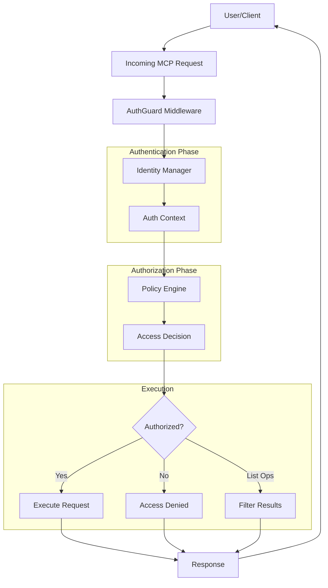
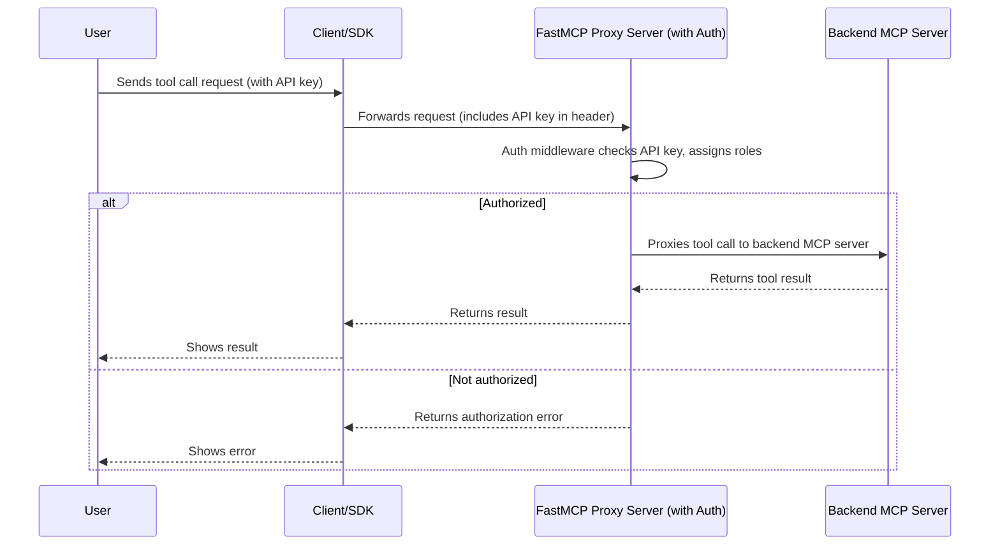

# 🛡️ MCP Auth Guard

**Intuitive authorization middleware for MCP tools with type-safe policies**

A modern, developer-friendly authorization system designed specifically for [Model Context Protocol (MCP)](https://modelcontextprotocol.io/) servers. Get fine-grained access control with simple YAML policies and seamless [FastMCP](https://gofastmcp.com/) integration.

## ✨ Key Features

- 🔐 **Multiple Auth Methods**: JWT, API keys, header-based, or no auth
- 📝 **Intuitive YAML Policies**: Easy-to-read, semantic policy definitions  
- 🎯 **Fine-grained Control**: Role-based, pattern-based, and conditional access
- ⚡ **Zero Latency**: In-process authorization with no external dependencies
- 🔍 **Comprehensive Auditing**: Detailed logging for security monitoring
- 🛠️ **Type-safe APIs**: Fluent policy builders with full type safety
- 🚀 **Developer-first**: Simple integration, great debugging experience

## User Flow 



## 🚀 Quick Start

### Installation

```bash
pip install mcp-auth-guard
```

### Basic Usage

```python
from fastmcp import FastMCP
from mcp_auth_guard import create_api_key_middleware
import asyncio
# Create your MCP server
mcp = FastMCP("My Secure Server")

@mcp.tool()
def safe_tool(data: str) -> str:
    """A safe tool that users can access."""
    return f"Safe processing: {data}"

@mcp.tool()  
def sensitive_operation(data: str) -> str:
    """A sensitive tool that requires admin access."""
    return f"Sensitive processing: {data}"

# Add Auth Guard middleware
auth_middleware = create_api_key_middleware(
    policies="./policies.yaml",
    api_key_roles={
        "user-key-123": ["user"],
        "admin-key-456": ["admin"]
    }
)
mcp.add_middleware(auth_middleware)

# Run your server
asyncio.run(mcp.run(transport="http"))
```

### Simple Policy Configuration

Create `policies.yaml`:

```yaml
name: "my_service_policy"
default_effect: "deny"

rules:
  - name: "admin_access"
    effect: "allow"
    agents:
      roles: ["admin"]
    tools:
      patterns: ["*"]  # All tools
    actions: ["list", "call"]

  - name: "user_limited_access"
    effect: "allow"
    agents:
      roles: ["user"]
    tools:
      names: ["safe_tool", "read_only_tool"]
    actions: ["list", "call"]
```

### Client Usage

Connect to your secured server:


```python
# User client - can access safe tools
import asyncio
from fastmcp import Client

client = Client({
    "mcpServers": {
        "my_service": {
            "url": "http://localhost:8000/mcp",
            "headers": {"X-API-Key": "user-key-123"}
        }
    }
})

async def main():
    async with client:
        # This works - user can access safe_tool
        result = await client.call_tool("my_service", "safe_tool", {"data": "test"})
        print(f"User result: {result}")
        
        # This would fail - user cannot access sensitive_operation
        # result = await client.call_tool("my_service", "sensitive_operation", {"data": "test"})

asyncio.run(main())
```

```python  
# Admin client - can access all tools
admin_client = Client({
    "mcpServers": {
        "my_service": {
            "url": "http://localhost:8000/mcp", 
            "headers": {"X-API-Key": "admin-key-456"}
        }
    }
})

async def admin_demo():
    async with admin_client:
        # Admin can access any tool
        result = await admin_client.call_tool("my_service", "sensitive_operation", {"data": "admin"})
        print(f"Admin result: {result}")

asyncio.run(admin_demo())
```

**[→ Learn to write policies](examples/POLICY_GUIDE.md)**

## 📋 Examples

### 🔒 Securing Existing MCP Servers with Proxy

Add authorization to **any existing MCP server** without modifying it:

```python
from fastmcp import Client, FastMCP
from mcp_auth_guard import create_api_key_middleware

# 1. Connect to existing SQLite MCP Server
config = {
    "mcpServers": {
        "sqlite": {
            "command": "uv",
            "args": [
                "--directory", "servers/src/sqlite",
                "run", "mcp-server-sqlite",
                "--db-path", "~/test.db"
            ]
        }
    }
}
client = Client(config)

# 2. Create proxy with authorization
proxy_server = FastMCP.as_proxy(client)
auth_middleware = create_api_key_middleware(
    policies="./database_policies.yaml",
    api_key_roles={
        "read-only-key-123": ["reader"],    # SELECT queries only
        "admin-key-456": ["admin"],         # Full database access
        "analyst-key-789": ["analyst"]      # Queries + views
    }
)
proxy_server.add_middleware(auth_middleware)

# 3. Run authorized proxy
proxy_server.run(transport="http", port=4200)
```

**Role-based Database Access**:
- **`reader`** role: Can only execute SELECT queries and view table schemas
- **`analyst`** role: Can query data, create views, but cannot modify database structure  
- **`admin`** role: Full database access including CREATE, DROP, INSERT, UPDATE operations
- **Security**: Automatically blocks dangerous SQL operations (DROP, DELETE, ALTER) for non-admin users

**Benefits**: ✅ No server changes ✅ Role-based DB access ✅ SQL injection prevention ✅ Audit logging



### 🌍 Weather Service Example

Check out the [**Weather Service Example**](examples/weather_service/) - a complete working demo with **all transport types**:

### 🌍 Weather Service Features
- **Multiple user roles** (admin, user, intern) 
- **Conditional access** (time-based restrictions)
- **Safety policies** (blocking dangerous operations)
- **Transport support** (STDIO, HTTP, SSE)
- **Comprehensive audit logging**

### 🧪 Test with Real MCP Client

```bash
cd examples/weather_service

# Simple HTTP client examples
python weather_server.py                    # Start server (terminal 1)
python basic_client.py                      # Basic client (terminal 2)
python http_roles_demo.py                   # Role-based demo (terminal 2)

# Comprehensive testing with all transports
python test_client.py                       # Test all roles (STDIO)
python test_client.py admin                 # Test specific role
python test_client.py admin http https://weather.api.com/mcp  # HTTP transport

# See examples/weather_service/ for complete demo
```

### 🎮 Interactive Demo
```bash
# Try the policy simulation
python test_client.py
```

## 🔐 Authentication Methods

### JWT Authentication

```python
from mcp_auth_guard import create_jwt_middleware

middleware = create_jwt_middleware(
    jwt_secret="your-secret-key",
    policies="./policies.yaml",
    required_claims=["sub", "role"]
)
```

### API Key Authentication

```python
from mcp_auth_guard import create_api_key_middleware

middleware = create_api_key_middleware(
    policies="./policies.yaml",
    api_key_roles={
        "admin-key-123": ["admin"],
        "user-key-456": ["user"],
        "readonly-key-789": ["readonly"]
    }
)
```

### Header-based Authentication

```python
from mcp_auth_guard import create_header_middleware

middleware = create_header_middleware(
    policies="./policies.yaml",
    header_mapping={
        "x-user-id": "user_id",
        "x-user-roles": "roles"
    }
)
```

## 📝 Policy Language

### Agent Matching

```yaml
agents:
  user_id: ["alice", "bob"]           # Specific users
  roles: ["admin", "developer"]       # User roles  
  agent_id: ["claude", "gpt-4"]      # Agent identifiers
  patterns: ["admin_*", "*_service"]  # Wildcard patterns
```

### Tool Matching

```yaml
tools:
  names: ["get_weather", "send_email"]    # Exact tool names
  patterns: ["get_*", "*_admin"]          # Wildcard patterns
  namespaces: ["weather", "admin"]        # Tool namespaces
  tags: ["safe", "public"]               # Tool tags
```

### Conditions

```yaml
conditions:
  - field: "tool.args.time"
    operator: "equals"
    value: "night"
    
  - field: "user.roles"
    operator: "in"
    value: ["admin", "moderator"]
    
  - field: "tool.name"
    operator: "regex"
    value: "^admin_.*"
```

## 🛠️ Type-safe Policy Building

For programmatic policy creation:

```python
from mcp_auth_guard.policy import policy, rule

# Build policies with code
my_policy = (policy("secure_service")
    .with_description("Security policy for my service")
    .deny_by_default()
    .add_rule(
        rule("admin_access")
        .for_roles("admin")
        .for_tool_patterns("*")
        .allow()
    )
    .add_rule(
        rule("user_read_only")
        .for_roles("user")
        .for_tool_patterns("get_*", "list_*")
        .when_equals("tool.args.readonly", True)
        .allow()
    )
    .build())
```

## 🔍 Policy Testing & Debugging

Built-in tools for testing your policies:

```python
# Test a policy
from mcp_auth_guard.policy import PolicyLoader, PolicyEngine
from mcp_auth_guard.schemas import AuthContext, ToolResource, ResourceContext

# Load and test
policy = PolicyLoader.load_from_file("policies.yaml")
engine = PolicyEngine([policy])

# Create test context
auth_ctx = AuthContext(user_id="alice", roles=["user"], authenticated=True)
resource_ctx = ResourceContext(
    resource_type="tool",
    resource=ToolResource(name="get_weather"),
    action="call",
    method="tools/call"
)

# Evaluate
decision = await engine.evaluate(auth_ctx, resource_ctx)
print(f"Allowed: {decision.allowed}, Reason: {decision.reason}")
```

## 🔧 Advanced Features

### Dynamic Policy Updates

```python
# Update policies at runtime
middleware.add_policy(new_policy)
middleware.remove_policy("old_policy_name")
middleware.reload_policies("./updated_policies/")
```

### Custom Conditions

```python
# Extend with custom condition evaluators
class TimeBasedCondition(PolicyCondition):
    def evaluate(self, context):
        current_hour = datetime.now().hour
        return 9 <= current_hour <= 17  # Business hours only
```

### Performance Monitoring

```python
# Built-in performance metrics
decision = await engine.evaluate(auth_ctx, resource_ctx)
print(f"Evaluation took: {decision.evaluation_time_ms}ms")
print(f"Rules evaluated: {decision.evaluated_rules}")
```

## 📚 Documentation

- [**Getting Started Guide**](docs/getting-started.md)
- [**Policy Reference**](docs/policy-reference.md)  
- [**Authentication Methods**](docs/authentication.md)
- [**API Reference**](docs/api-reference.md)
- [**Migration from Eunomia v1**](docs/migration.md)

## 🤝 Contributing

We welcome contributions! Please see our [Contributing Guide](CONTRIBUTING.md) for details.

## 📄 License

Apache License 2.0. See [LICENSE](LICENSE) for details.

---

**Built with ❤️ for the MCP community**
